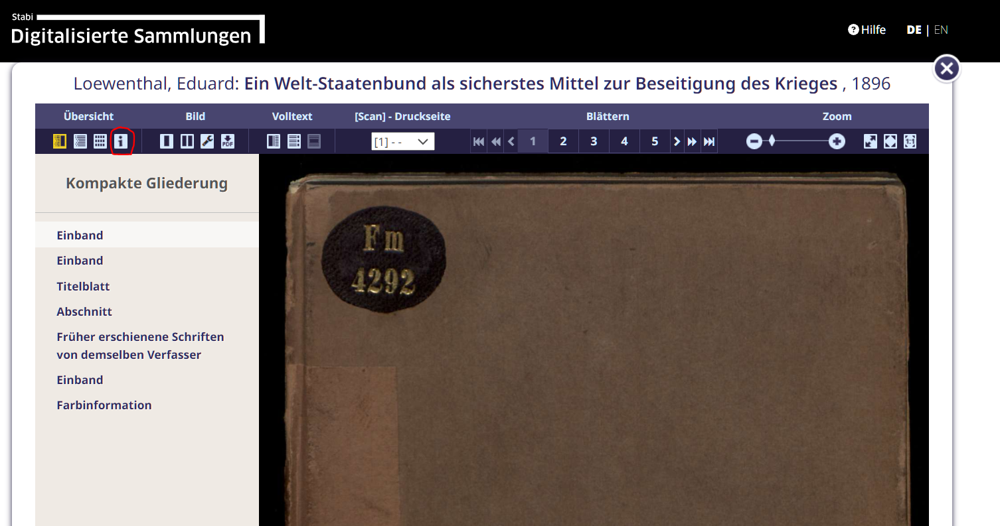
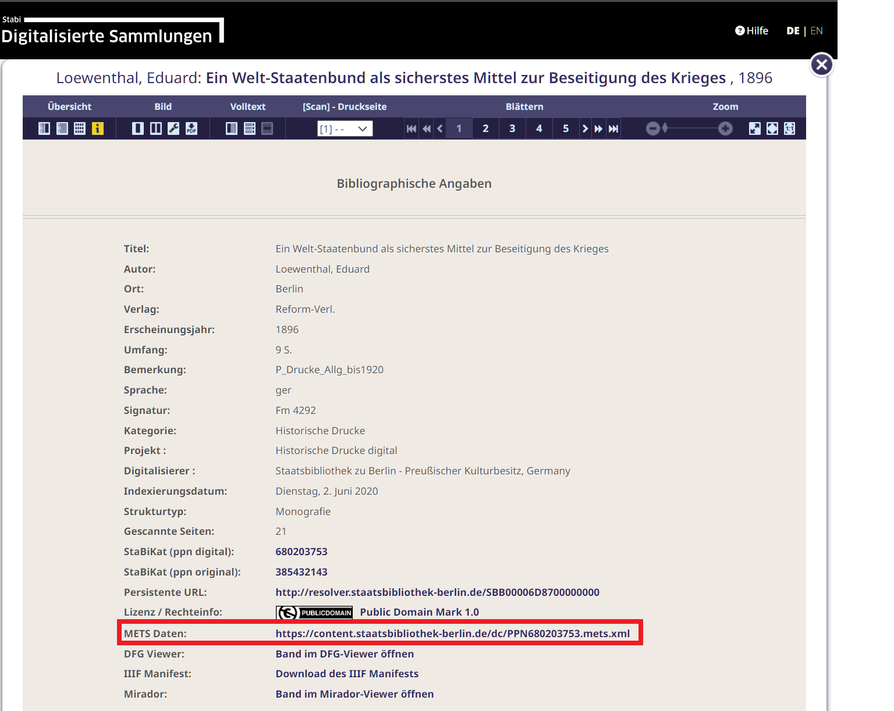

# Werke aus digitalen Bibliotheken mit OCR-D laden

Als ersten Einstieg in OCR-D wollen wir ein bilddigitalisiertes Werk aus einer Digitalen Bibliothek laden mit dem `ocrd workspace clone` Befehl und uns die Ergebnisse ansehen

## METS Link kopieren

Als Beispiel wählen wir hier https://digital.staatsbibliothek-berlin.de/werkansicht?PPN=PPN680203753
aber es kann prinzipiell jedes Werk aus einer deutschen Bibliothek geladen werden, dass gemäß
den [DFG Praxisregeln Digitalisierung](https://www.dfg.de/resource/blob/176108/898bf3574ad0ff3b1db525fa7d04c86c/12-151-v1216-de-data.pdf)
digitalisiert wurde und für die eine METS-XML Datei verfügbar ist. Für historische Drucke ist das meistens der Fall.

METS-XML ist ein Dateiformat, dass digitale Objekte beschreibt und enthält
neben bibliografischen und technischen Metadaten Referenzen auf die Dateien
die das Werk repräsentieren, sowie die physische Struktur (welche Dateien bilden welche Seiten ab) und
ggf. logische Struktur (Inhaltsverzeichnis).

Wie man an die METS-Datei gelangt, hängt von der jeweiligen Digitalen Bibliothek ab, aber im Allgemeinen
findet man einen Link darauf im Metadaten-Bereich.

In den Digitalisierten Sammlungen der Staatsbibliothek zu Berlin findet man die METS-Datei durch Klick auf den `[i]` Info-Button:



Dort den Link zu den "METS Daten" kopieren:



## Klonen des Workspaces

Wir erzeugen einen neuen Workspace, d.h. einen Ordner mit der METS-Datei, in dem die OCR-D Verarbeitung stattfinden soll, mit dem folgenden Befehl:

```sh
❯ ocrd workspace -d lowenthal1896 clone 'https://content.staatsbibliothek-berlin.de/dc/PPN680203753.mets.xml'
/home/kba/DHd2024-demo/cli-demo/loewenthal1896
```

Das Ergebnis ist ein Ordner `loewenthal1896` mit einer Datei `mets.xml`.

## Inspizieren des Workspaces

Wir können uns jetzt die Dateigruppen (`mets:fileGrp`) und Dateien (`mets:file`) ansehen und entscheiden, welche Dateien wir herunterladen möchten.

```sh
❯ ocrd workspace -d loewenthal1896 list-group
FULLTEXT
PRESENTATION
THUMBS
DEFAULT
```

Die Bezeichnungen der Dateigruppen variieren, folgen aber im Wesentlichen demselben Schema:

* `FULLTEXT` enthält bereits existierende OCR, üblicherweise im ALTO-XML Format (in diesem Beispiel enthalten sie allerdings Links auf Bilder, die wir ignorieren)
* `PRESENTATION` und `THUMBS` sind herunterskalierte Versionen der Bilder für die Digitale Bibliothek
* `DEFAULT` (bisweilen auch `MAX`) sind meist die höchsten verfügbaren Auflösungen der Bilder, die wir für die OCR verwenden möchten

**TIP**: Um später mit `browse-ocrd` arbeiten zu können, entfernen wir alle Dateigruppen, die nicht benötigt werden:

```sh
❯ ocrd workspace -d loewenthal1896 remove-group --recursive --force THUMBS PRESENTATION FULLTEXT
```

Als nächstes sehen wir uns an, welche Dateien in `DEFAULT` vorhanden sind. Wir
wollen wissen was die jeweilige URL ist, welche Seite repräsentiert wird und
welchen Media Type die Dateien haben:


```sh
❯ ocrd workspace -d loewenthal1896 find --file-grp DEFAULT -k url -k mimetype -k pageId
https://content.staatsbibliothek-berlin.de/dc/PPN680203753-00000001/full/max/0/default.jpg      image/jpg       PHYS_0001
https://content.staatsbibliothek-berlin.de/dc/PPN680203753-00000002/full/max/0/default.jpg      image/jpg       PHYS_0002
https://content.staatsbibliothek-berlin.de/dc/PPN680203753-00000003/full/max/0/default.jpg      image/jpg       PHYS_0003
https://content.staatsbibliothek-berlin.de/dc/PPN680203753-00000004/full/max/0/default.jpg      image/jpg       PHYS_0004
https://content.staatsbibliothek-berlin.de/dc/PPN680203753-00000005/full/max/0/default.jpg      image/jpg       PHYS_0005
https://content.staatsbibliothek-berlin.de/dc/PPN680203753-00000006/full/max/0/default.jpg      image/jpg       PHYS_0006
https://content.staatsbibliothek-berlin.de/dc/PPN680203753-00000007/full/max/0/default.jpg      image/jpg       PHYS_0007
https://content.staatsbibliothek-berlin.de/dc/PPN680203753-00000008/full/max/0/default.jpg      image/jpg       PHYS_0008
https://content.staatsbibliothek-berlin.de/dc/PPN680203753-00000009/full/max/0/default.jpg      image/jpg       PHYS_0009
https://content.staatsbibliothek-berlin.de/dc/PPN680203753-00000010/full/max/0/default.jpg      image/jpg       PHYS_0010
https://content.staatsbibliothek-berlin.de/dc/PPN680203753-00000011/full/max/0/default.jpg      image/jpg       PHYS_0011
https://content.staatsbibliothek-berlin.de/dc/PPN680203753-00000012/full/max/0/default.jpg      image/jpg       PHYS_0012
https://content.staatsbibliothek-berlin.de/dc/PPN680203753-00000013/full/max/0/default.jpg      image/jpg       PHYS_0013
https://content.staatsbibliothek-berlin.de/dc/PPN680203753-00000014/full/max/0/default.jpg      image/jpg       PHYS_0014
https://content.staatsbibliothek-berlin.de/dc/PPN680203753-00000015/full/max/0/default.jpg      image/jpg       PHYS_0015
https://content.staatsbibliothek-berlin.de/dc/PPN680203753-00000016/full/max/0/default.jpg      image/jpg       PHYS_0016
https://content.staatsbibliothek-berlin.de/dc/PPN680203753-00000017/full/max/0/default.jpg      image/jpg       PHYS_0017
https://content.staatsbibliothek-berlin.de/dc/PPN680203753-00000018/full/max/0/default.jpg      image/jpg       PHYS_0018
https://content.staatsbibliothek-berlin.de/dc/PPN680203753-00000019/full/max/0/default.jpg      image/jpg       PHYS_0019
https://content.staatsbibliothek-berlin.de/dc/PPN680203753-00000020/full/max/0/default.jpg      image/jpg       PHYS_0020
https://content.staatsbibliothek-berlin.de/dc/PPN680203753-00000021/full/max/0/default.jpg      image/jpg       PHYS_0021
```

Wir sehen, dass die Bilder JPEG-Bilder sind und die IDs der Seiten dem Schema
`PHYS_<NR>` folgen, wobei `<NR>` die Nummer der Seite und vierstellig mit
führenden Nullen ist.

## Herunterladen der Bilder

Mithilfe des `ocrd workspace find` Befehls und der `--download` Option laden wir die Bilder aus der `DEFAULT` Dateigruppe herunter:

(wir setzen das logging level mit `-l DEBUG` herunter, damit wir den Fortschritt der Downloads sehen)

```sh
❯ ocrd -l DEBUG workspace -d loewenthal1896 find --file-grp DEFAULT --download
```

Wir verifizieren das die Dateien heruntergeladen sind mit dem `find` Befehl:

```sh
❯ find loewenthal1896
loewenthal1896
loewenthal1896/mets.xml
loewenthal1896/DEFAULT
loewenthal1896/DEFAULT/FILE_0012_DEFAULT.jpg
loewenthal1896/DEFAULT/FILE_0003_DEFAULT.jpg
loewenthal1896/DEFAULT/FILE_0010_DEFAULT.jpg
loewenthal1896/DEFAULT/FILE_0008_DEFAULT.jpg
loewenthal1896/DEFAULT/FILE_0020_DEFAULT.jpg
loewenthal1896/DEFAULT/FILE_0017_DEFAULT.jpg
loewenthal1896/DEFAULT/FILE_0016_DEFAULT.jpg
loewenthal1896/DEFAULT/FILE_0007_DEFAULT.jpg
loewenthal1896/DEFAULT/FILE_0004_DEFAULT.jpg
loewenthal1896/DEFAULT/FILE_0015_DEFAULT.jpg
loewenthal1896/DEFAULT/FILE_0002_DEFAULT.jpg
loewenthal1896/DEFAULT/FILE_0009_DEFAULT.jpg
loewenthal1896/DEFAULT/FILE_0019_DEFAULT.jpg
loewenthal1896/DEFAULT/FILE_0014_DEFAULT.jpg
loewenthal1896/DEFAULT/FILE_0021_DEFAULT.jpg
loewenthal1896/DEFAULT/FILE_0018_DEFAULT.jpg
loewenthal1896/DEFAULT/FILE_0011_DEFAULT.jpg
loewenthal1896/DEFAULT/FILE_0005_DEFAULT.jpg
loewenthal1896/DEFAULT/FILE_0006_DEFAULT.jpg
loewenthal1896/DEFAULT/FILE_0001_DEFAULT.jpg
loewenthal1896/DEFAULT/FILE_0013_DEFAULT.jpg
```

Der Workspace ist jetzt soweit vollständig, dass wir OCR durchführen können.

**TIP**: Clonen und Download können auch in einem Schritt durchgeführt werden:

```sh
❯ ocrd -l DEBUG workspace -d loewenthal1896 clone -q DEFAULT --download https://content.staatsbibliothek-berlin.de/dc/PPN680203753.mets.xml
```
